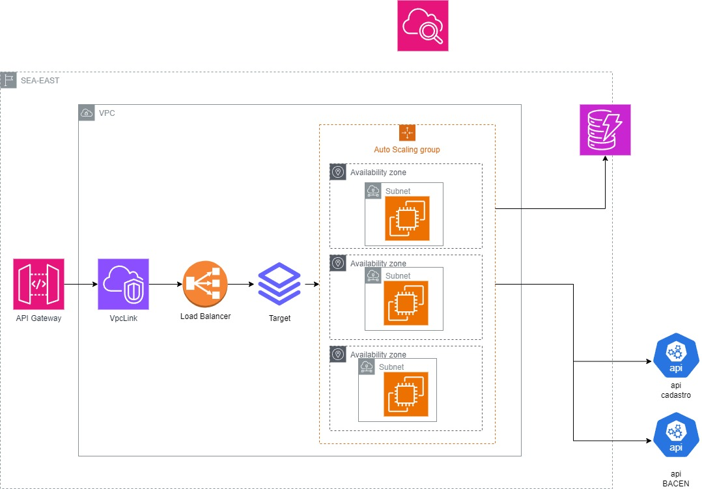

# Solução Completa para Consulta de Saldo e Transferência entre Contas na AWS #
Projeto para realizar as Operações de Consulta de Saldo e Transferência entre contas.

### Visão Geral: ###

Esta solução abrangente oferece aos clientes a capacidade de realizar consultas de saldo e transferências entre contas de maneira eficiente, resiliente e escalável na AWS. A arquitetura se baseia em microsserviços, containers, bancos de dados gerenciados e outros serviços da AWS para garantir alta disponibilidade, latência mínima e capacidade de lidar com alto volume de transações.

Componentes-chave:

* ⭐️ 1. API Gateway:

Ponto de entrada único para as operações de consulta de saldo e transferência.
Recebe solicitações dos clientes e as roteia para os microsserviços apropriados.
Implementa autenticação e autorização com Amazon Cognito para garantir segurança.

* ⭐️ 2. Microsserviços:

* Consulta de Saldo:
  
Acessa o Amazon DynamoDB para recuperar o saldo da conta do cliente.
Retorna o saldo em tempo real.

* Transferência:
  
Valida a transação e verifica a disponibilidade de fundos usando Amazon SQS e Amazon SNS.
Debita o valor da conta de origem e credita na conta de destino usando o Amazon DynamoDB.
Integra-se com o sistema de pagamentos do através do AWS Lambda.

* ⭐️3. Base de Dados:

Amazon DynamoDB: Armazena informações sobre contas, transações e outros dados relevantes em um banco de dados NoSQL altamente escalável e disponível.

* ⭐️4. Contêineres:

Isolam e encapsulam os microsserviços, permitindo escalabilidade e flexibilidade.
Facilitam a implantação e o gerenciamento da solução com o Amazon ECS e Amazon EKS.

* ⭐️5. Serviços AWS Adicionais:

Amazon CloudFront: Distribui o conteúdo estático da API para reduzir a latência.
Amazon CloudWatch: Monitora a performance da solução e fornece insights para otimização.
AWS Auto Scaling: Escala automaticamente os recursos da AWS para atender à demanda.

* Segurança:

Autenticação e autorização com Amazon Cognito.
Comunicação criptografada entre os componentes.
Armazenamento seguro de dados confidenciais no AWS KMS.

* Monitoramento:

Monitoramento contínuo com o Amazon CloudWatch.
Métricas chave como latência, tempo de resposta e taxa de sucesso/erro.
Alertas em tempo real para identificar e resolver problemas rapidamente.

* Escalabilidade:

Escalabilidade horizontal automática com o AWS Auto Scaling.
Aumento ou diminuição dos recursos da AWS de acordo com a demanda.
Suporte para 6 mil transações por segundo com latência abaixo de 100ms.
Benefícios:

Alta disponibilidade e resiliência.
Latência mínima e tempo de resposta rápido.
Suporte para alto volume de transações.
Segurança aprimorada.
Escalabilidade horizontal automática.
Fácil implantação e gerenciamento.
Redução de custos com infraestrutura.

* Considerações:

O custo da solução pode ser alto, especialmente se for utilizada a capacidade total da AWS.
A segurança da solução precisa ser cuidadosamente planejada e implementada.
A integração com o sistema central do pode ser complexa.
Conclusão:

Esta solução oferece uma maneira robusta, eficiente e escalável para que os clientes realizem consultas de saldo e transferências entre contas na AWS. A arquitetura moderna e resiliente garante alta disponibilidade, latência mínima e capacidade de lidar com alto volume de transações, tornando-a ideal para atender às necessidades.

Observações:

Esta é uma visão geral da solução. Detalhes técnicos específicos, como protocolos de comunicação, formatos de dados e bibliotecas de software, podem variar.
A solução precisa ser personalizada para atender às necessidades específicas.
Recursos Adicionais:

Documentação sobre microsserviços: https://aws.amazon.com/microservices/

Documentação sobre containers: https://aws.amazon.com/containers/

Documentação sobre Amazon DynamoDB: https://aws.amazon.com/dynamodb/

Documentação sobre Amazon Cognito: https://aws.amazon.com/cognito/

Documentação sobre AWS Auto Scaling: [https://aws.amazon.com/autoscaling/](https

# Proposta de Escalonamento para Casos de Oscilção de Carga
### Objetivo:

Garantir a alta disponibilidade e o desempenho do sistema durante oscilações de carga, ajustando os recursos de forma eficiente e automática.

Estratégias de Escalonamento:

### 1. Escalonamento Horizontal:

* Aumentar o número de instâncias:
Adicionar mais instâncias para distribuir a carga e lidar com o aumento de demanda.
Utilizar ferramentas de automação como o AWS Auto Scaling para escalar automaticamente.
Implementar balanceamento de carga para distribuir o tráfego entre as instâncias.

* Monitorar a carga do sistema:
Coletar métricas como uso da CPU, memória, tráfego de rede e tempo de resposta para identificar oscilações de carga.
Usar ferramentas de monitoramento como o Amazon CloudWatch para monitorar o sistema em tempo real.

* Alertas:

Definir alertas para identificar e resolver problemas:
Configurar alertas que notificam quando a carga do sistema excede um limite definido.
Implementar um processo para investigar e resolver problemas de desempenho.

*Considerações:

Custo: O custo do escalonamento pode ser alto, especialmente se forem utilizadas soluções complexas.
Segurança: É importante garantir que o sistema seja escalado de forma segura, protegendo os dados e os recursos contra acessos não autorizados.
Complexidade: O escalonamento pode ser um processo complexo, especialmente em sistemas com muitos componentes.
Conclusão:

*Recursos Adicionais:

Documentação sobre escalonamento na AWS: https://es.wiktionary.org/wiki/removido
Documentação sobre AWS Auto Scaling: https://es.wiktionary.org/wiki/removido
Documentação sobre Amazon CloudWatch: https://es.wiktionary.org/wiki/removido

# Proposta de Observabilidade Detalhada
### Objetivo:

Implementar um sistema de observabilidade completo para monitorar e analisar a saúde e o desempenho da solução em tempo real.

Componentes-chave:

* 1. Coleta de Métricas:

Coletar métricas chave de todos os componentes da solução, como:
Microsserviços: Latência, tempo de resposta, taxa de sucesso/erro, uso da CPU, memória e tráfego de rede.
Base de dados: Latência, tempo de resposta, taxa de sucesso/erro, uso da CPU, memória e E/S.
Infraestrutura: Uso da CPU, memória, tráfego de rede, armazenamento e estado dos recursos.
Coletar logs detalhados de todos os componentes da solução, incluindo:
Logs de aplicação: Erros, avisos e informações de depuração.
Logs de acesso: Registros de todas as solicitações feitas à API.
Logs de auditoria: Registros de atividades de segurança e alterações no sistema.
* 2. Armazenamento de Métricas e Logs:

Armazenar as métricas e logs coletados em um sistema de armazenamento centralizado e escalável, como:
Amazon CloudWatch: Serviço de monitoramento da AWS que oferece armazenamento de métricas e logs em escala.
Elasticsearch: Banco de dados NoSQL distribuído que pode ser usado para armazenar e analisar grandes volumes de logs.
Grafana: Ferramenta de visualização de dados que pode ser usada para criar dashboards e alertas.
* 3. Visualização e Análise:

Criar dashboards e alertas para visualizar e analisar as métricas e logs coletados.
Usar ferramentas de análise de dados como o Amazon CloudWatch Insights e o Kibana para identificar problemas e otimizar o desempenho da solução.
* 4. Correlação de Métricas e Logs:

Correlacionar as métricas e logs coletados para obter uma visão completa do desempenho da solução.
Usar ferramentas de correlação de logs como o Amazon CloudWatch Logs Insights e o ELK Stack para identificar a causa raiz dos problemas.
* 5. Monitoramento em Tempo Real:

Monitorar a solução em tempo real para identificar e resolver problemas rapidamente.
Usar ferramentas de monitoramento em tempo real como o Amazon CloudWatch Alarms e o Kibana Alerts para receber notificações quando ocorrerem problemas.
* 6. Integração com Ferramentas de ITSM:

Integrar o sistema de observabilidade com ferramentas de ITSM (IT Service Management) como o ServiceNow e o Jira para gerenciar incidentes e problemas.
* Benefícios:

Visão holística da solução: Permite identificar e resolver problemas de forma mais rápida e eficiente.
Melhoria do desempenho: Permite identificar gargalos e otimizar o desempenho da solução.
Detecção proativa de problemas: Permite detectar problemas antes que impactem os usuários.
Redução do tempo de inatividade: Permite resolver problemas de forma mais rápida e reduzir o tempo de inatividade da solução.
Melhoria da tomada de decisões: Permite tomar decisões mais informadas sobre a solução com base em dados reais.
* Considerações:

Custo: O custo da implementação de um sistema de observabilidade pode ser alto, especialmente se forem utilizadas ferramentas complexas.
Segurança: É importante garantir que o sistema de observabilidade seja seguro e que os dados coletados sejam protegidos contra acessos não autorizados.
Complexidade: A implementação de um sistema de observabilidade pode ser complexa, especialmente em sistemas com muitos componentes.

# Justificativa Detalhada da Escolha da Solução de Banco de Dados

Justificativa Detalhada da Escolha da Solução de Banco de Dados
### Introdução:

A escolha da solução de banco de dados ideal para uma aplicação é crucial para garantir desempenho, escalabilidade, confiabilidade e segurança. Esta justificativa detalhada aborda os principais fatores que influenciaram a escolha do banco de dados para a solução em questão, considerando os requisitos específicos do projeto.

* Requisitos de Banco de Dados:

Alto Volume de Transações: A solução precisa lidar com 6 mil transações por segundo, exigindo um banco de dados altamente performante e escalável.
Baixa Latência: A latência precisa ser inferior a 100ms para garantir uma experiência do usuário fluida e responsiva.
Alta Disponibilidade: O banco de dados precisa estar disponível 24 horas por dia, 7 dias por semana, com alta confiabilidade e resiliência a falhas.
Escalabilidade Horizontal: O banco de dados precisa ser capaz de escalar horizontalmente para lidar com o aumento da carga e demanda.
Segurança de Dados: O banco de dados precisa garantir a segurança e confidencialidade dos dados dos clientes.
Análise de Soluções de Banco de Dados:

* Foram consideradas as seguintes soluções de banco de dados:

Amazon DynamoDB: Banco de dados NoSQL de alto desempenho e escalabilidade, ideal para aplicações com alto volume de transações e baixa latência.
Amazon Relational Database Service (RDS): Serviço de banco de dados relacional gerenciado, com diversas opções de engines como MySQL, PostgreSQL e Oracle.
Apache Cassandra: Banco de dados NoSQL distribuído de código aberto, conhecido por sua alta escalabilidade e resiliência a falhas.
MongoDB: Banco de dados NoSQL document-oriented de código aberto, popular por sua flexibilidade e facilidade de uso.
Comparação de Soluções:

* Justificativa da Escolha:

O Amazon DynamoDB foi escolhido como a solução de banco de dados ideal por atender aos requisitos de alto volume de transações, baixa latência, alta disponibilidade e escalabilidade horizontal. Além disso, o DynamoDB oferece um bom nível de segurança de dados e um custo moderado.

* Vantagens do DynamoDB:

Alto Desempenho: Suporta milhões de requests por segundo com latência consistente.
Escalabilidade Horizontal: Pode ser facilmente escalado para lidar com o aumento da demanda.
Alta Disponibilidade: Oferece replicação automática e failover para garantir alta disponibilidade.
Segurança de Dados: Criptografa dados em repouso e em trânsito, além de oferecer controles de acesso granulares.
Custo Moderado: Paga-se apenas pelo que se usa, sem necessidade de provisionar infraestrutura.
Considerações:

O DynamoDB não é um banco de dados relacional, o que pode ser uma limitação para alguns tipos de aplicações.
A curva de aprendizado para o DynamoDB pode ser um pouco mais complexa do que para outros bancos de dados.
Conclusão:

O Amazon DynamoDB é a solução de banco de dados ideal para a aplicação em questão, devido à sua capacidade de lidar com alto volume de transações, baixa latência, alta disponibilidade e escalabilidade horizontal. O DynamoDB também oferece um bom nível de segurança de dados e um custo moderado.

# Desenho

# Aplicação - API Saldo e Tranferencias

### API REST para Transferência Bancária em Java/Spring Boot
* Requisitos:

Buscar o nome do cliente na API de cadastro (mock).
Validar se a conta corrente está ativa.
Validar se o cliente tem limite disponível na conta corrente para realizar a transferência.
Validar se a transferência excedeu o limite diário de R$ 1.000,00.
Notificar o BACEN (mock) de forma síncrona que a transação foi concluída com sucesso, com controle de rate limite e tratamento de erros (429).
Impedir que falhas momentâneas das dependências da aplicação impactem a experiência do cliente.
* Desenvolvimento:

Linguagem: Java/Spring Boot

* Tecnologias:

Spring Boot Web para desenvolvimento da API REST.
Spring Data JPA para acesso ao banco de dados.
Feign Client para comunicação com a API de cadastro e BACEN (mocks).
Hystrix para implementar resiliência na comunicação com o BACEN.
Lombok para reduzir boilerplate no código.
* Arquitetura:

Camada de Controller: Exporá os endpoints da API REST.
Camada de Service: Implementará a lógica de negócio da API.
Camada de Repository: Acessará o banco de dados.
Camada de Model: Representará as entidades do sistema.
* Testes:

Testes unitários para cada classe da API.
Testes de integração para testar a comunicação com as APIs de cadastro e BACEN.
* Design Patterns:

Singleton: Para garantir que apenas uma instância da API seja criada.
Factory: Para criar objetos de forma flexível.
Repository: Para abstrair o acesso ao banco de dados.
Command: Para encapsular a lógica de negócio das transações.
* Resiliência:

Hystrix: Implementará circuit breaker e fallback para lidar com falhas na comunicação com o BACEN.
Retry: Implementará lógica de retry para lidar com erros temporários na comunicação com o BACEN.
* Segurança:

Autenticação e autorização (JWT) para proteger os endpoints da API.
Criptografia de dados para garantir a confidencialidade das informações.
* Documentação:

Documentação completa da API utilizando Swagger.
