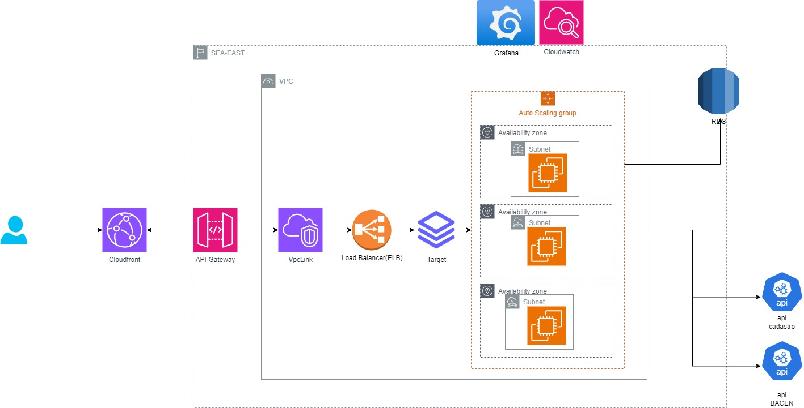

# Solução Completa para Consulta de Saldo e Transferência entre Contas na AWS #
Projeto para realizar as Operações de Consulta de Saldo e Transferência entre contas.

### Visão Geral: ###

Esta solução abrangente oferece aos clientes a capacidade de realizar consultas de saldo e transferências entre contas de maneira eficiente, resiliente e escalável na AWS. A arquitetura se baseia em microsserviços, containers, bancos de dados gerenciados e outros serviços da AWS para garantir alta disponibilidade, latência mínima e capacidade de lidar com alto volume de transações.

Componentes-chave:

* ⭐️ 1. API Gateway:

Ponto de entrada único para as operações de consulta de saldo e transferência.
Recebe solicitações dos clientes e as roteia para os microsserviços apropriados.
Implementa autenticação e autorização com Amazon Cognito para garantir segurança.

* ⭐️ 2. Microsserviços:

* Consulta de Saldo:
  
Acessa o Amazon DynamoDB para recuperar o saldo da conta do cliente.
Retorna o saldo em tempo real.

* Transferência:
  
Valida a transação e verifica a disponibilidade de fundos usando Amazon SQS e Amazon SNS.
Debita o valor da conta de origem e credita na conta de destino usando o Amazon DynamoDB.
Integra-se com o sistema de pagamentos do através do AWS Lambda.

* ⭐️3. Base de Dados:

Amazon DynamoDB: Armazena informações sobre contas, transações e outros dados relevantes em um banco de dados NoSQL altamente escalável e disponível.

* ⭐️4. Contêineres:

Isolam e encapsulam os microsserviços, permitindo escalabilidade e flexibilidade.
Facilitam a implantação e o gerenciamento da solução com o Amazon ECS e Amazon EKS.

* ⭐️5. Serviços AWS Adicionais:

Amazon CloudFront: Distribui o conteúdo estático da API para reduzir a latência.
Amazon CloudWatch: Monitora a performance da solução e fornece insights para otimização.
AWS Auto Scaling: Escala automaticamente os recursos da AWS para atender à demanda.

* Segurança:

Autenticação e autorização com Amazon Cognito.
Comunicação criptografada entre os componentes.
Armazenamento seguro de dados confidenciais no AWS KMS.

* Monitoramento:

Monitoramento contínuo com o Amazon CloudWatch.
Métricas chave como latência, tempo de resposta e taxa de sucesso/erro.
Alertas em tempo real para identificar e resolver problemas rapidamente.

* Escalabilidade:

Escalabilidade horizontal automática com o AWS Auto Scaling.
Aumento ou diminuição dos recursos da AWS de acordo com a demanda.
Suporte para 6 mil transações por segundo com latência abaixo de 100ms.
Benefícios:

Alta disponibilidade e resiliência.
Latência mínima e tempo de resposta rápido.
Suporte para alto volume de transações.
Segurança aprimorada.
Escalabilidade horizontal automática.
Fácil implantação e gerenciamento.
Redução de custos com infraestrutura.

* Considerações:

O custo da solução pode ser alto, especialmente se for utilizada a capacidade total da AWS.
A segurança da solução precisa ser cuidadosamente planejada e implementada.
A integração com o sistema central do pode ser complexa.
Conclusão:

Esta solução oferece uma maneira robusta, eficiente e escalável para que os clientes realizem consultas de saldo e transferências entre contas na AWS. A arquitetura moderna e resiliente garante alta disponibilidade, latência mínima e capacidade de lidar com alto volume de transações, tornando-a ideal para atender às necessidades.

Observações:

Esta é uma visão geral da solução. Detalhes técnicos específicos, como protocolos de comunicação, formatos de dados e bibliotecas de software, podem variar.
A solução precisa ser personalizada para atender às necessidades específicas.
Recursos Adicionais:

Documentação sobre microsserviços: https://aws.amazon.com/microservices/

Documentação sobre containers: https://aws.amazon.com/containers/

Documentação sobre Amazon DynamoDB: https://aws.amazon.com/dynamodb/

Documentação sobre Amazon Cognito: https://aws.amazon.com/cognito/

Documentação sobre AWS Auto Scaling: [https://aws.amazon.com/autoscaling/](https

# Proposta de Escalonamento para Casos de Oscilção de Carga
### Objetivo:

Garantir a alta disponibilidade e o desempenho do sistema durante oscilações de carga, ajustando os recursos de forma eficiente e automática.

Estratégias de Escalonamento:

### 1. Escalonamento Horizontal:

* Aumentar o número de instâncias:
Adicionar mais instâncias para distribuir a carga e lidar com o aumento de demanda.
Utilizar ferramentas de automação como o AWS Auto Scaling para escalar automaticamente.
Implementar balanceamento de carga para distribuir o tráfego entre as instâncias.

* Monitorar a carga do sistema:
Coletar métricas como uso da CPU, memória, tráfego de rede e tempo de resposta para identificar oscilações de carga.
Usar ferramentas de monitoramento como o Amazon CloudWatch para monitorar o sistema em tempo real.

* Alertas:

Definir alertas para identificar e resolver problemas:
Configurar alertas que notificam quando a carga do sistema excede um limite definido.
Implementar um processo para investigar e resolver problemas de desempenho.

*Considerações:

Custo: O custo do escalonamento pode ser alto, especialmente se forem utilizadas soluções complexas.
Segurança: É importante garantir que o sistema seja escalado de forma segura, protegendo os dados e os recursos contra acessos não autorizados.
Complexidade: O escalonamento pode ser um processo complexo, especialmente em sistemas com muitos componentes.
Conclusão:

*Recursos Adicionais:

Documentação sobre escalonamento na AWS: https://es.wiktionary.org/wiki/removido
Documentação sobre AWS Auto Scaling: https://es.wiktionary.org/wiki/removido
Documentação sobre Amazon CloudWatch: https://es.wiktionary.org/wiki/removido


# Proposta de Observabilidade Detalhada
### Objetivo:

Implementar um sistema de observabilidade completo para monitorar e analisar a saúde e o desempenho da solução em tempo real.

Componentes-chave:

* 1. Coleta de Métricas:

Coletar métricas chave de todos os componentes da solução, como:
Microsserviços: Latência, tempo de resposta, taxa de sucesso/erro, uso da CPU, memória e tráfego de rede.
Base de dados: Latência, tempo de resposta, taxa de sucesso/erro, uso da CPU, memória e E/S.
Infraestrutura: Uso da CPU, memória, tráfego de rede, armazenamento e estado dos recursos.
Coletar logs detalhados de todos os componentes da solução, incluindo:
Logs de aplicação: Erros, avisos e informações de depuração.
Logs de acesso: Registros de todas as solicitações feitas à API.
Logs de auditoria: Registros de atividades de segurança e alterações no sistema.
* 2. Armazenamento de Métricas e Logs:

Armazenar as métricas e logs coletados em um sistema de armazenamento centralizado e escalável, como:
Amazon CloudWatch: Serviço de monitoramento da AWS que oferece armazenamento de métricas e logs em escala.
Elasticsearch: Banco de dados NoSQL distribuído que pode ser usado para armazenar e analisar grandes volumes de logs.
Grafana: Ferramenta de visualização de dados que pode ser usada para criar dashboards e alertas.
* 3. Visualização e Análise:

Criar dashboards e alertas para visualizar e analisar as métricas e logs coletados.
Usar ferramentas de análise de dados como o Amazon CloudWatch Insights e o Kibana para identificar problemas e otimizar o desempenho da solução.
* 4. Correlação de Métricas e Logs:

Correlacionar as métricas e logs coletados para obter uma visão completa do desempenho da solução.
Usar ferramentas de correlação de logs como o Amazon CloudWatch Logs Insights e o ELK Stack para identificar a causa raiz dos problemas.
* 5. Monitoramento em Tempo Real:

Monitorar a solução em tempo real para identificar e resolver problemas rapidamente.
Usar ferramentas de monitoramento em tempo real como o Amazon CloudWatch Alarms e o Kibana Alerts para receber notificações quando ocorrerem problemas.
* 6. Integração com Ferramentas de ITSM:

Integrar o sistema de observabilidade com ferramentas de ITSM (IT Service Management) como o ServiceNow e o Jira para gerenciar incidentes e problemas.
* Benefícios:

Visão holística da solução: Permite identificar e resolver problemas de forma mais rápida e eficiente.
Melhoria do desempenho: Permite identificar gargalos e otimizar o desempenho da solução.
Detecção proativa de problemas: Permite detectar problemas antes que impactem os usuários.
Redução do tempo de inatividade: Permite resolver problemas de forma mais rápida e reduzir o tempo de inatividade da solução.
Melhoria da tomada de decisões: Permite tomar decisões mais informadas sobre a solução com base em dados reais.
* Considerações:

Custo: O custo da implementação de um sistema de observabilidade pode ser alto, especialmente se forem utilizadas ferramentas complexas.
Segurança: É importante garantir que o sistema de observabilidade seja seguro e que os dados coletados sejam protegidos contra acessos não autorizados.
Complexidade: A implementação de um sistema de observabilidade pode ser complexa, especialmente em sistemas com muitos componentes.


# Justificativa Detalhada da Escolha da Solução de Banco de Dados

* Introdução:

Este documento apresenta uma justificativa detalhada da escolha do banco de dados para a API de Transferência Bancária, considerando os requisitos específicos do projeto e as características dos principais candidatos: Amazon Relational Database Service (RDS) e Amazon DynamoDB.

* Requisitos do Banco de Dados:

Armazenamento de dados transacionais:
Registro de transações bancárias (transferências).
Informações de clientes e contas bancárias.
Histórico de transações para auditoria e análise.
Desempenho e escalabilidade:
Suporte a um alto volume de transações (6.000 TPS).
Baixa latência (< 100ms) para garantir uma experiência de usuário fluida.
Escalabilidade vertical e horizontal para lidar com o crescimento da demanda.
Alta disponibilidade e confiabilidade:
Minimizar o tempo de inatividade e garantir a disponibilidade contínua da API.
Replicação de dados para garantir a recuperação em caso de falhas.
Segurança:
Proteção contra acesso não autorizado, violações de dados e ataques cibernéticos.
Criptografia de dados em repouso e em trânsito.

* Custo:
Solução econômica que atenda às necessidades do projeto sem comprometer o desempenho ou a confiabilidade.
Facilidade de gerenciamento:
Interface de gerenciamento intuitiva e fácil de usar.
Suporte técnico e documentação abrangentes.

* Justificativa da Escolha:

O RDS foi escolhido como a solução de banco de dados para a API de Transferência Bancária pelos seguintes motivos:

Natureza dos dados: Os dados armazenados pela API são estruturados e relacionais, como transações bancárias, registros de clientes e contas. O RDS é otimizado para lidar com esse tipo de dado, oferecendo melhor desempenho e confiabilidade.
Desempenho: O RDS oferece latência previsível, crucial para garantir uma experiência de usuário rápida e confiável ao realizar transferências bancárias.
Escalabilidade: O RDS oferece escalabilidade vertical e horizontal, permitindo que a API lide com o crescimento da demanda sem comprometer o desempenho.
Alta disponibilidade e confiabilidade: O RDS oferece replicação de dados e outras features que garantem a alta disponibilidade e confiabilidade da API.
Segurança: O RDS oferece recursos de segurança robustos, como criptografia de dados e controle de acesso, para proteger os dados contra violações.
Custo: O custo do RDS é previsível e pode ser otimizado de acordo com as necessidades do projeto.
Facilidade de gerenciamento: O RDS oferece uma interface de gerenciamento intuitiva e fácil de usar, além de suporte técnico e documentação abrangentes.

* Considerações sobre o DynamoDB:

Embora o DynamoDB seja uma opção viável para alguns projetos, ele não foi escolhido para este caso pelas seguintes razões:

Natureza dos dados: O DynamoDB não é otimizado para dados estruturados e relacionais como os que serão armazenados pela API.
Desempenho: O DynamoDB pode ter latência variável, o que pode afetar negativamente a experiência do usuário ao realizar transações bancárias.
Complexidade: O DynamoDB pode ser mais complexo de configurar e gerenciar para este tipo de projeto, especialmente para equipes com menos experiência com bancos de dados NoSQL.

* Conclusão:

O RDS foi escolhido como a melhor solução de banco de dados para a API de Transferência Bancária devido à sua capacidade de atender aos requisitos específicos do projeto em termos de natureza dos dados, desempenho, escalabilidade, alta disponibilidade e confiabilidade, segurança, custo e facilidade de gerenciamento.

# Desenho


# Aplicação - API Saldo e Tranferencias


### API REST para Transferência Bancária em Java/Spring Boot
* Requisitos:

Buscar o nome do cliente na API de cadastro (mock).
Validar se a conta corrente está ativa.
Validar se o cliente tem limite disponível na conta corrente para realizar a transferência.
Validar se a transferência excedeu o limite diário de R$ 1.000,00.
Notificar o BACEN (mock) de forma síncrona que a transação foi concluída com sucesso, com controle de rate limite e tratamento de erros (429).
Impedir que falhas momentâneas das dependências da aplicação impactem a experiência do cliente.
* Desenvolvimento:

Linguagem: Java/Spring Boot

* Tecnologias:

Spring Boot Web para desenvolvimento da API REST.
Spring Data JPA para acesso ao banco de dados.
Feign Client para comunicação com a API de cadastro e BACEN (mocks).
Hystrix para implementar resiliência na comunicação com o BACEN.
Lombok para reduzir boilerplate no código.

* Testes:

Testes unitários para cada classe da API.
Testes de integração para testar a comunicação com as APIs de cadastro e BACEN.

* Arquitetura:
  


* Design Patterns:
  
[CAMADA DOMAIN]
Esta é a camada central da nossa aplicação e a mais importante, ela é a mais próxima das regras de negócio da aplicação, ou seja, e quando definidas não sofrem tantas mudanças, como nas outras camadas e ainda é independente de todas as outras camadas.

UseCases: nessa camada ficará as classes responsáveis em dizer quais as ações o usuário poderá executar no sistema, como comprar um produto ou até mesmo cancelar um pedido.
“O software da camada de casos de uso contém as regras de negócio específicas da aplicação”

Trecho de: Robert C. Martin. “Arquitetura Limpa (Robert C. Martin)”. Apple Books.

Entities: As entidades são uma representação dos objetos de negócio da aplicação.
“As Entidades reúnem as Regras Cruciais de Negócios da empresa inteira”

Trecho de: Robert C. Martin. “Arquitetura Limpa (Robert C. Martin)”. Apple Books.

Repositories: Os repositories nessa camada são a representação por meio de interfaces abstratas, enquanto a implementação é feita em outra camada.
[CAMADA DATA]

Esta camada é a responsável pela comunicação entre nossa aplicação e o mundo exterior, como exemplo, a comunicação com uma API ou um banco de dados.

Repositories: esta camada é a implementação dos repositories abstratos, contidos em outra camada, a implementação faz operações como busca, remoção, atualização ou inserção de dados entre nossa aplicação a camada datasources, fazendo assim o meio de campo entre os dois extremos.
Models: são espelhos das entities, porém podem conter métodos, como conversão de dados de entrada e saída, hash code e outros.
DataSources: executará solicitações HTTP GET na API ou simplesmente armazenará em cache os dados usando o banco de dados h2.
* Resiliência:

Hystrix: Implementará circuit breaker e fallback para lidar com falhas na comunicação com o BACEN.
Retry: Implementará lógica de retry para lidar com erros temporários na comunicação com o BACEN.
* Segurança:

Autenticação e autorização (JWT) para proteger os endpoints da API.
Criptografia de dados para garantir a confidencialidade das informações.
* Documentação:

Documentação completa da API utilizando Swagger.

# Arquitetura de Solução

### Arquitetura de Solução em AWS para API de Transferência Bancária

* Desafio:

Desenvolver uma solução escalável, resiliente e de alta performance para a API de Transferência Bancária em Java/Spring Boot, utilizando a plataforma AWS.

* Requisitos:

Escalabilidade: Suporte a oscilações de carga e alto throughput (6.000 TPS).
Observabilidade: Monitoramento completo da solução.
Banco de dados: Solução eficiente e confiável.
Caching: Otimização de performance.
Tempo de resposta: Inferior a 100ms.
Alta disponibilidade: Minimizar impacto no cliente em caso de falhas.
Resiliência: Lidar com throttling do BACEN.
*Proposta de Solução:

* Componentes:

Balanceador de carga Elastic Load Balancing (ELB): Distribui o tráfego entre as instâncias da API.
Auto Scaling: Ajusta automaticamente o número de instâncias da API conforme a demanda.
Amazon EC2: Instâncias para execução da API.
Amazon Relational Database Service (RDS): Banco de dados relacional para armazenar dados da API.
Amazon ElastiCache: Armazena em cache dados frequently accessed para otimizar performance.
Amazon CloudWatch: Monitora métricas da API, como tempo de resposta, erros e latência.
AWS Lambda: Função para processar notificações do BACEN em caso de throttling.
Amazon SNS: Notifica os clientes sobre falhas na API.
* Escalabilidade:

Auto Scaling: Aumenta ou diminui o número de instâncias da API automaticamente.
Amazon EC2: Utilize instâncias com poder de processamento adequado para a demanda.
Sharding: Distribua dados em múltiplos servidores RDS para aumentar a capacidade.
* Observabilidade:

Amazon CloudWatch: Monitora logs, métricas e eventos da API.
Dashboards: Crie dashboards para visualizar as métricas da API em tempo real.
Alertas: Configure alertas para ser notificado sobre problemas na API.
*Banco de dados:

Amazon RDS: Banco de dados relacional gerenciado, confiável e escalável.
Aurora: Motor de banco de dados MySQL e PostgreSQL com alta performance e escalabilidade.
Sharding: Distribua dados em múltiplos servidores RDS para aumentar a capacidade.
*Caching:

Amazon ElastiCache: Armazena em cache dados frequently accessed para reduzir o tempo de resposta.
Redis: Utilize Redis como solução de cache em memória.
Memcached: Utilize Memcached como solução de cache em memória.
*Tempo de resposta:

Amazon EC2: Utilize instâncias com poder de processamento adequado para a demanda.
Amazon ElastiCache: Utilize cache para armazenar dados frequently accessed.
Otimização de código: Otimize o código da API para melhorar o tempo de resposta.
* Alta disponibilidade:

Auto Scaling: Garante que a API esteja sempre disponível mesmo em caso de falhas de instâncias.
Multi-AZ: Implante a API em múltiplas zonas de disponibilidade para aumentar a resiliência.
Amazon RDS: Banco de dados gerenciado com alta disponibilidade.
* Resiliência:

Hystrix: Implemente Hystrix para lidar com falhas na comunicação com o BACEN.
Retry: Implemente lógica de retry para lidar com erros temporários.
AWS Lambda: Função para processar notificações do BACEN em caso de throttling.
* Segurança:

Amazon Cognito: Autentique e autorize os usuários da API.
AWS Identity and Access Management (IAM): Controle o acesso aos recursos da AWS.
Criptografia: Criptografe os dados da API em repouso e em trânsito.

# Módulo Terraform para API de Transferência Bancária
Objetivo:

### Criar um módulo Terraform que automatiza a provisionamento da infraestrutura AWS para a API de Transferência Bancária.

Requisitos:

Balanceador de carga Elastic Load Balancing (ELB)
Auto Scaling
Amazon EC2
Amazon Relational Database Service (RDS)
Amazon ElastiCache
Amazon CloudWatch
AWS Lambda
Amazon SNS
Módulo Terraform:

```tf
module "api_transferencia_bancaria" {
  source = "path/to/module"

  # Parâmetros

  vpc_id = var.vpc_id
  subnet_ids = var.subnet_ids
  security_group_id = var.security_group_id
  rds_instance_type = var.rds_instance_type
  rds_database_name = var.rds_database_name
  cache_node_type = var.cache_node_type
  lambda_function_name = var.lambda_function_name
  sns_topic_name = var.sns_topic_name

  # Saídas

  elb_dns_name = output.elb_dns_name
  rds_endpoint = output.rds_endpoint
  cache_endpoint = output.cache_endpoint
}
```
Variáveis:
```tf
variable "vpc_id" {
  type = string
}

variable "subnet_ids" {
  type = list(string)
}

variable "security_group_id" {
  type = string
}

variable "rds_instance_type" {
  type = string
}

variable "rds_database_name" {
  type = string
}

variable "cache_node_type" {
  type = string
}

variable "lambda_function_name" {
  type = string
}

variable "sns_topic_name" {
  type = string
}

```
Exemplo de Uso:
```tf
resource "aws_vpc" "default" {
  cidr_block = "10.0.0.0/16"
}

resource "aws_subnet" "public" {
  vpc_id = aws_vpc.default.id
  cidr_block = "10.0.1.0/24"
  availability_zone = "us-east-1a"
}

resource "aws_subnet" "private" {
  vpc_id = aws_vpc.default.id
  cidr_block = "10.0.2.0/24"
  availability_zone = "us-east-1b"
}

resource "aws_security_group" "api" {
  vpc_id = aws_vpc.default.id
  ingress {
    from_port = 80
    to_port = 80
    protocol = "tcp"
    cidr_blocks = ["0.0.0.0/0"]
  }
  egress {
    from_port = 0
    to_port = 0
    protocol = "-1"
    cidr_blocks = ["0.0.0.0/0"]
  }
}

module "api_transferencia_bancaria" {
  source = "path/to/module"

  vpc_id = aws_vpc.default.id
  subnet_ids = [aws_subnet.public.id, aws_subnet.private.id]
  security_group_id = aws_security_group.api.id
  rds_instance_type = "db.t2.small"
  rds_database_name = "transferencia_bancaria"
  cache_node_type = "cache.t2.small"
  lambda_function_name = "lambda_notificacao_bacen"
  sns_topic_name = "sns_topic_transferencia_bancaria"
}

output "elb_dns_name" {
  value = module.api_transferencia_bancaria.elb_dns_name
}

output "rds_endpoint" {
  value = module.api_transferencia_bancaria.rds_endpoint
}

output "cache_endpoint" {
  value = module.api_transferencia_bancaria.cache_endpoint
}
```
